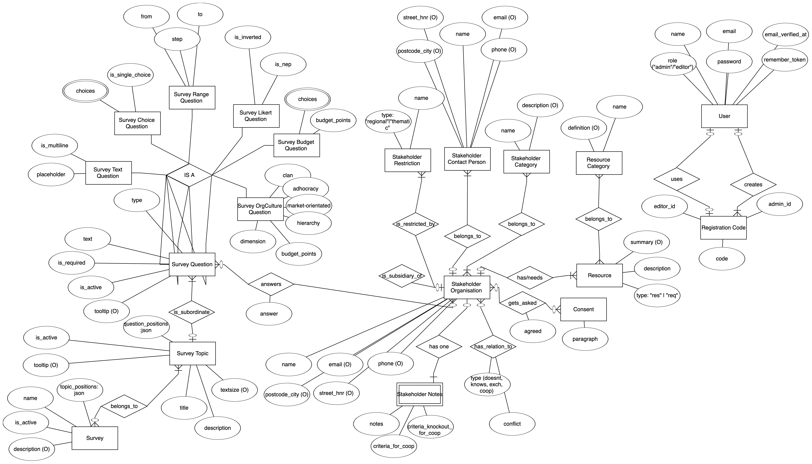

netweave

## About Netweave

Netweave aims to connect Organizations with scientific methods on a local level.
This software application holds a database with information about organizations, their relations, resources and requirements.
The Netweave platform serves two main functions: Being a custom questions survey & giving networking advice & suggestions for local organizations.

## About the TechStack

Netweave is built with Laravel connected with React by Inertia.js.

## Database Schema

see [entities-relations.md](./docs/db/entities-relations.md) for more details.

## Deployment

Deploy your `Laravel + Inertia + React / Vue` application to a shared hosting server

#### I. First time set up

1. LOCALLY
   1. `npm install`
   2. `npm run build` (or `tsc && vite build`)
2. REMOTE
   1. create a directory for your application, choose any name, e.g. `mkdir ~/my.application.com`. This is where your application will live.\
   2. create a directory named `public` inside the new dir, e.g. `mkdir ~/my.application.com/public`
   3. configure your server to point at that `public` directory.
      1. e.g. for Ionos Web Hosting go to https://mein.ionos.de/webhosting, select "connect webspace to directory", choose `~/my.application.com/public`
   4. test it:
      1. create an example index.html: `touch ~/my.application.com/public/index.html``
      2. fill it with any content: `echo "
hello world
" >> ~/my.application.com/public/index.html`
      3. Now you should be able to see the Hello World page in the browser on `my.application.com`
   5. delete the public folder for now, `rm -r ~/my.application.com/public`
3. REMOTE <-> LOCAL
   1. Now upload the real application, upload all the files and folders into `~/my.application.com/` (overwriting the public folder), except
      1. `node_modules` not needed since `vite build` bundled all needed javascript to the build folder
      2. `vendor` not needed since we will install the dependencies later directly to the server itself
      3. `.git` not needed (it is needed if you want to deploy changes via git of course, but for that `npm` must be executable on your server)
4. REMOTE
   1. configure your .env file with Database information provided by your shared web hosting portal
      1. e.g. for me I had to set `DB_HOST`, `DB_DATABASE`, `DB_USERNAME` and `DB_PASSWORD`.
      2. also when deploying for production, set `APP_DEBUG` to `false` and `APP_ENV` to `production`.
   2. For me it was necessary to make one important change in your `.htaccess` file
      1. instead of `RewriteRule ^ index.php [L]` I added a slash before index.php -> `RewriteRule ^ /index.php [L]`
   3. install composer dependencies
      1. download composer.phar via curl from the official website
      2. run `php composer.phar install --no-dev --optimize-autoloader`
   4. `php artisan storage:link`
   5. `php artisan migrate`
   6. allow the web server application to access the directories and files
      1. `chmod -R 755 ~/my.application.com`
      2. `chmod -R 775 ~/my.application.com/storage ~/my.application.com/bootstrap/cache`
   7. make some optimizations, activate caching for better performance
      1. `php artisan optimize`
      2. `php artisan config:cache`
      3. `php artisan event:cache`
      4. `php artisan route:cache`

#### II. Deploy new version / Update the app

1. LOCALLY
   1. `npm install`
   2. `npm run build` (or `tsc && vite build`)
2. REMOTE <-> LOCAL
   1. upload and overwrite all the files and folders except
      1. `.env` you should not overwrite the production `.env` file with your local `.env` file (better compare the old .env (on the server) with the new .env.example)
      2. `node_modules` not needed since `vite build` bundled all needed javascript to the build folder
      3. `vendor` not needed since we will install the dependencies later directly to the server itself
      4. `.git` not needed (it is needed if you want to deploy changes via git of course, but for that `npm` must be executable on your server)
   2. be sure that there is no file `public/hot`. Delete that file if it exists.
3. REMOTE
   1. `source ~/.bashrc`
   2. `composer install --no-dev --optimize-autoloader`
   3. `php artisan storage:link`
   4. `php artisan migrate`
   5. allow the web server application to access the directories and files
      1. `chmod -R 755 ~/my.application.com`
      2. `chmod -R 775 ~/my.application.com/storage ~/my.application.com/bootstrap/cache`
   6. make some optimizations, activate caching for better performance
      1. `php artisan optimize`
      2. `php artisan config:cache`
      3. `php artisan event:cache`
      4. `php artisan route:cache`
